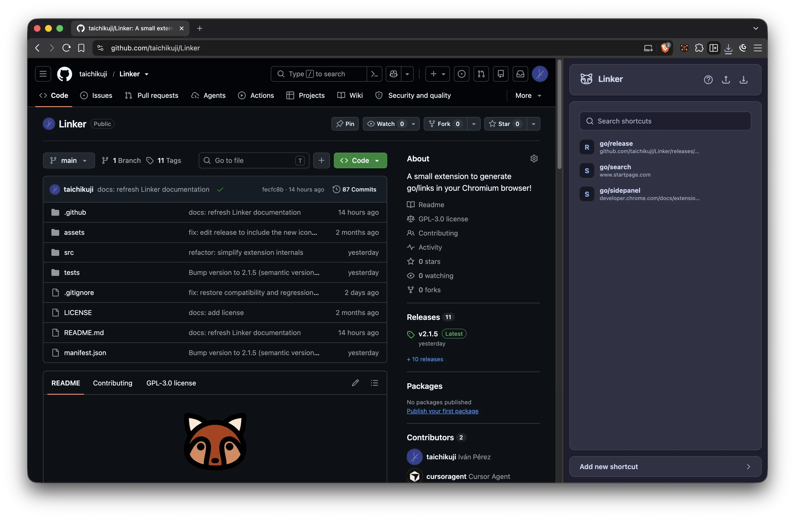

<p align="center">
  
</p>

<h1 align="center">Linker</h1>

<p align="center">
  Create personal <code>go/</code> shortcuts for the websites you use most.
</p>

Linker gives frequently visited URLs a short, memorable name. Create a
shortcut such as `go/docs`, type it in the address bar when you need it, and
let the browser take you there.

It is a small tool for your own browser, not a new service to sign up for. The
manager lives in the browser's side panel, and your shortcut data stays in
Chrome sync storage rather than being sent to a developer-operated backend.

## Preview

<p align="center">
  
</p>

## What it does

- Create, edit, search, and delete personal `go/` shortcuts.
- Open shortcuts from the manager or by entering `go/<shortcut>` in the address bar.
- Use `{*}` for parameterized shortcuts, such as `go/issues/123`.
- Define a default destination for a parameterized shortcut when no value is supplied.
- Open the manager in Chromium's side panel.
- Import and export shortcut data as JSON.
- Keep shortcuts available through Chrome sync storage.
- Respect light and dark system themes.
- Migrate compatible shortcut data from [Linkify](https://chromewebstore.google.com/detail/linkify/gojgbkejhelijlkgpmlbbkklljgmfljj).

For examples and the full explanation, see the [How to use Linker guide](https://github.com/taichikuji/Linker/wiki/How-to-use-Linker).

## What it does not do

- It is not a public URL shortener or a link-hosting service.
- It does not proxy, inspect, or rewrite the destination server's content.
- It is not a general bookmark manager with folders, tags, or a reading queue.
- It does not need a separate Linker account or developer-operated backend.
- It does not replace the browser's history, bookmarks, or ordinary search.

Linker keeps the useful part simple: give a URL a name, then use that name
when you already know where you want to go.

## Installation

Linker supports current desktop Chromium browsers, including Google Chrome,
Brave, Microsoft Edge, Opera, Vivaldi, and compatible Chromium forks.

1. Open your browser's extensions page (`chrome://extensions`,
   `brave://extensions`, or `edge://extensions`).
2. Enable **Developer mode**.
3. Choose **Load unpacked** and select this directory.
4. Pin Linker to the toolbar so its side panel is easy to open.

For the canonical usage instructions, see the [How to use Linker guide](https://github.com/taichikuji/Linker/wiki/How-to-use-Linker).

## A small note about Firefox

Linker was created for Chromium-based browsers and has not been fully tested
on Firefox. Firefox support has also not been requested, so maintaining a build
that cannot be confidently validated is outside Linker's current scope.

## Development

The project has no runtime dependencies. Run the test suite with Node.js 20 or
newer:

```bash
node --test
```

Before releasing, test the extension in Chrome and at least one other Chromium
browser such as Brave or Edge. Check the side panel at narrow and wide widths,
URL prefill, direct and parameterized shortcuts, import/export, redirect rules,
and behavior after restarting the browser. The release workflow is documented
in [GUIDE.md](.github/workflows/GUIDE.md).

## Contributing

Linker is intentionally small, but sensible improvements are welcome. If an
idea solves a real problem without making personal shortcuts harder to
understand, open an issue or pull request and explain the use case.

## Support

Linker is not currently published in the Chrome Web Store. If you would like
to help with that someday, you can [buy the author a coffee via PayPal](https://paypal.me/ivanperezf).

## Icon palette

- White: [#fce7d2](https://www.color-hex.com/color/fce7d2)
- Orange: [#db8758](https://www.color-hex.com/color/db8758)
- Brown: [#b13d14](https://www.color-hex.com/color/b13d14)

Found a bug or have an idea? Please report it with enough context to reproduce
the behavior. Thanks for taking the time to use Linker.
