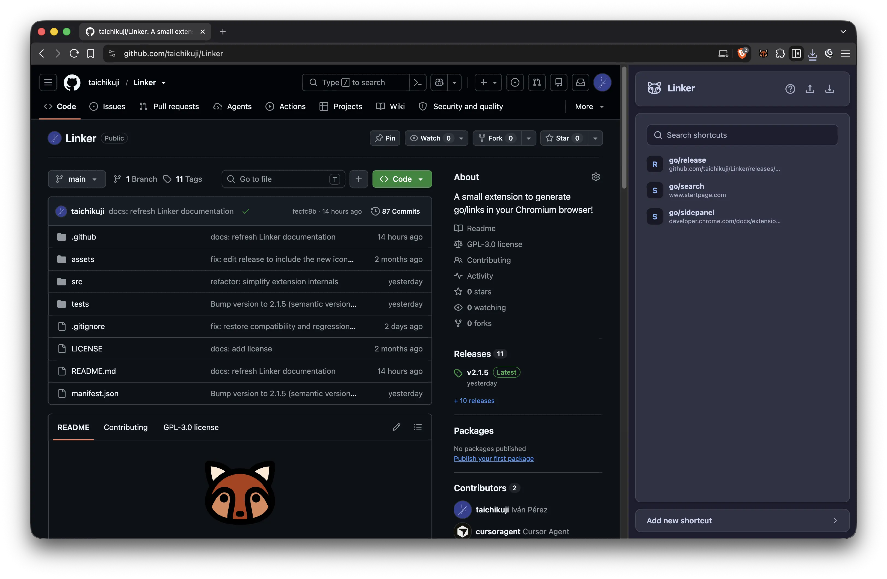
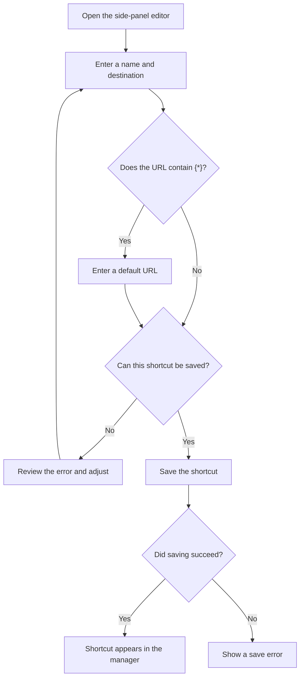
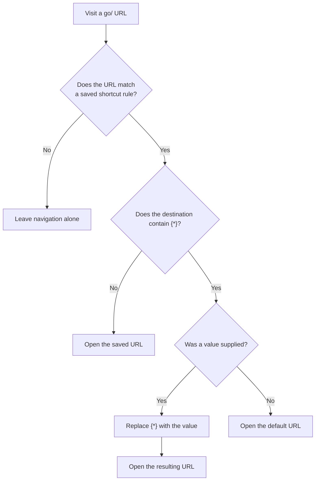

<p align="center">
  
</p>

<h1 align="center">Linker</h1>

<p align="center">
  Create personal <code>go/</code> shortcuts for the websites you use most. 🦝
</p>

Know what go/links are? Great!

Don't know what go/links are? If curious, read about it [here!](https://www.trot.to/history-of-go-links)

Linker brings personal `go/` shortcuts to your browser, with routing handled locally.

## Preview

<p align="center">
  
</p>

## How it works

Linker's core workflow is simple: create a shortcut, then use `go/` to open it quickly.

### Save a shortcut

Click the Linker toolbar icon to open the side-panel manager, then select **Add new shortcut**. Use a unique, URL-safe name and an HTTP or HTTPS destination. A destination containing `{*}` requires a default URL for use without a value. Linker checks these inputs and the browser's shortcut capacity before saving; to change an existing shortcut, edit it instead.


```mermaid
flowchart TD
  accTitle: Save a Linker shortcut
  accDescr: Enter a name and destination, add a default URL if the destination contains a variable, and save if validation and capacity checks pass. Otherwise, review the error and adjust the shortcut. Saving reports success or an error.
  A["Open the side-panel editor"] --> B["Enter a name and destination"]
  B --> C{"Does the URL contain {*}?"}
  C -->|Yes| D["Enter a default URL"]
  C -->|No| E{"Can this shortcut be saved?"}
  D --> E
  E -->|No| F["Review the error and adjust"]
  F --> B
  E -->|Yes| G["Save the shortcut"]
  G --> H{"Did saving succeed?"}
  H -->|Yes| I["Shortcut appears in the manager"]
  H -->|No| J["Show a save error"]
```

### Open a shortcut

Visit `go/<shortcut>` to open its destination. For example, save `issues` with destination `https://github.com/taichikuji/Linker/issues/{*}` and default URL `https://github.com/taichikuji/Linker/issues`: `go/issues/123` opens issue 123, while `go/issues` opens the issue list.


```mermaid
flowchart TD
  accTitle: Open a Linker shortcut
  accDescr: Only URLs matching a saved shortcut rule are redirected. A regular shortcut opens its saved URL. A destination containing a variable uses the supplied value, or opens its default URL when no value is supplied.
  A["Visit a go/ URL"] --> B{"Does the URL match<br/>a saved shortcut rule?"}
  B -->|No| C["Leave navigation alone"]
  B -->|Yes| D{"Does the destination contain {*}?"}
  D -->|No| E["Open the saved URL"]
  D -->|Yes| F{"Was a value supplied?"}
  F -->|Yes| G["Replace {*} with the value"]
  G --> H["Open the resulting URL"]
  F -->|No| I["Open the default URL"]
```

Ordinary URLs, unknown shortcuts, and unsupported `go/` paths receive no redirect from Linker. For example, a shortcut without `{*}` does not accept an extra path such as `go/docs/123`.

The manager lets you search, edit, delete, and open shortcuts in a new tab. Opening a shortcut containing `{*}` from the manager uses its default URL. In Chrome's address bar, type `go/` and press Space to see saved shortcut names matching the prefix you type; unknown or unsupported inputs do not open a tab.

You can export shortcuts as JSON and import them into Linker, including compatible [Linkify](https://chromewebstore.google.com/detail/linkify/gojgbkejhelijlkgpmlbbkklljgmfljj) exports. Shortcuts use Chrome's sync storage and can sync between browsers according to your Chrome Sync settings. The manager follows your browser's light or dark theme.

Linker routes shortcuts in your browser without a developer-operated server or a Linker account. Destination websites, Chrome's favicon support, and Chrome Sync may use the network.

For examples and the full explanation, see the [How to use Linker guide](https://github.com/taichikuji/Linker/wiki/How-to-use-Linker).

Read the [Linker Privacy Policy](PRIVACY.md) for details about shortcut data and Chrome Sync.

## Installation

Install Linker from the [Chrome Web Store](https://chromewebstore.google.com/detail/linker/nacggecaljkbjoghmiidmkpgpkfpmhgm).

## A small note about Firefox

Although Linker supports MV3 which is also supported on Firefox, there's no official support for this as I do not personally use it.

You may want to port the extension to Firefox. I won't stop you. If you want to help me do this, I'd also appreciate it!

## Development

To develop new features, or fix bugs, follow this;

The project has no runtime dependencies. Run the test suite with Bun:

```bash
bun test
```

Before releasing, test the extension in Chrome and at least one other Chromium browser such as Brave or Edge. Check the side panel at narrow and wide widths, URL prefill, direct and parameterized shortcuts, import/export, redirect rules, and behavior after restarting the browser. The release workflow is documented in [GUIDE.md](.github/workflows/GUIDE.md).

## Contributing

I am more than happy to see and welcome contributors! Just please respect my way of coding.

I like things minimal and code should be readable and efficient.
If you see something you'd genuinely do better than me, I'd be more than happy to accept a Pull Request from you!

## Support

If you would like to support me, you can [buy me a coffee via PayPal](https://paypal.me/ivanperezf).

## Icon palette

- White: [#fce7d2](https://www.color-hex.com/color/fce7d2)
- Orange: [#db8758](https://www.color-hex.com/color/db8758)
- Brown: [#b13d14](https://www.color-hex.com/color/b13d14)

Found a bug or have an idea? Please report it with enough context to reproduce the behavior.

Thanks for taking the time to use Linker.

Much love 🦝❤️
